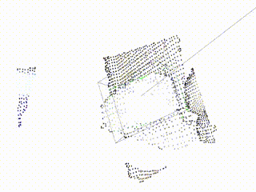

# onapy
Onapy contains, you know, masturbator motion detector and sound player based on the motion.



Ona comes from Japanese name of the masturbator "Onahole".

## Requirements
* GPU
* Depth camera from realsense series (D435i or something)
* masturbator

## Installation
Please install appropriate torch and mmcv version.

For example, for cuda11, please install like this.

```bash
conda create -n py38_onapy python=3.8.5

conda activate py38_onapy

pip install torch==1.7.1+cu110 torchvision==0.8.2+cu110 torchaudio===0.7.2 -f https://download.pytorch.org/whl/torch_stable.html
pip install mmcv-full==1.2.7 -f https://download.openmmlab.com/mmcv/dist/cu110/torch1.7.0/index.html

git clone git@github.com:xiong-jie-y/onapy.git onapy
cd onapy
pip install -r requirements.txt
pip install -e .

# Download masturbator detection model.
gdown https://drive.google.com/uc?id=1BhFSaFhk_w0BTHrstSTMYCTrMh6FE-Gw -O models/onaho_model.pth

# Please put your favorite sounds into the folder.
# These sound will be chosen randomly and played,
# when masturbator is moved (estemated as inserted).
cp *.mp3 sounds/
```

## How to run it.
```bash
python scripts/run_onaho_sound_player.py
```

After that, just move the masturbator.